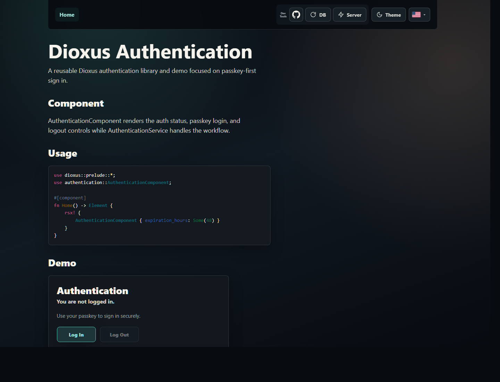
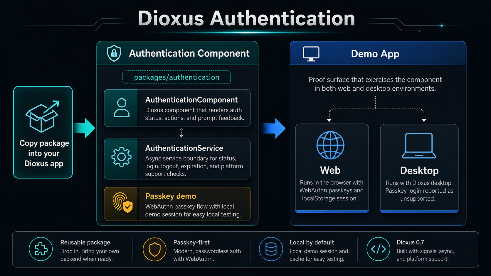

# Dioxus Authentication

Dioxus Authentication is a reusable passkey-first authentication component for Dioxus 0.7 apps. This repo also includes a runnable demo so you can try the component first, then copy the focused `packages/dioxus-authentication-component` package into your own Dioxus workspace when it fits your project.

## TOC

- [TOC](#toc)
- [Live Demo](#live-demo)
- [Pics](#pics)
- [Getting Started](#getting-started)
  - [Common Scripts](#common-scripts)
  - [Other Scripts](#other-scripts)
- [Authentication Component](#authentication-component)
- [Demo](#demo)
- [Bring Auth Into Your Project](#bring-auth-into-your-project)
- [Details](#details)
  - [Structure](#structure)
  - [Features](#features)
- [Credits](#credits)

## Live Demo

https://samuelasherrivello.github.io/dioxus-authentication/

The static web build is exported and hosted automatically with each push to the main branch. The hosted HTTPS demo can run the browser passkey flow. For local passkey testing, run the app at `http://localhost:8080`; browsers require localhost or HTTPS for WebAuthn.

## Pics

| Screenshot | Infographic |
| ---------- | ----------- |
|  |  |

## Getting Started

### Common Scripts

| Command | Required? | Description |
| ------- | --------- | ----------- |
| `.\Scripts\Common\InstallDependencies.ps1` | ✅ | Installs Rust, the wasm target, Dioxus CLI, and runs a validation build. |
| `.\Scripts\Common\RunWeb.ps1` | ✅ | Starts the web demo at `http://localhost:8080` for passkey testing; pass `-Lan` for same-Wi-Fi viewing without passkey support. |

### Other Scripts

| Command | Required? | Description |
| ------- | --------- | ----------- |
| `.\Scripts\Other\RunDesktop.ps1` | ❌ | Starts the desktop demo with Dioxus desktop. On Windows, desktop uses the native Win32 WebAuthn API so Windows owns the passkey prompt. |
| `.\Scripts\Other\RunTests.ps1` | ❌ | Runs RunWeb script tests and UI/auth crate tests. |

## Authentication Component

`packages/dioxus-authentication-component` is the primary artifact in this repo. It owns the reusable component, auth service boundary, component stylesheet, optional confirmation prompt, and auth Fluent bundles so it can be carried into another Dioxus app without dragging the whole demo along.

| Public Surface | Role |
| -------------- | ---- |
| `AuthenticationView` | Dioxus component that renders auth status and login/logout controls. |
| `AuthenticationViewConfig` | Config object for session detail, provider choices, status signal, busy signal, and login/logout handlers. |
| `AuthenticationConfirmationPrompt` | Optional localized confirmation dialog for apps that want the package-owned logout prompt. |
| `prelude` | Short import module for common component, service, config, provider, locale, and constant exports. |
| `authentication_locales()` | Built-in auth Fluent resources for app-level `dioxus-i18n` setup. |
| `AuthenticationService` | Async service boundary for current session, current status, login, logout, session expiration, and platform support checks. |
| `AuthenticationSession` | Canonical service-layer session shape that can be backed by local demo state today or a Dioxus fullstack request session later. |
| `AuthenticationStatus` | Rendered auth state projected from `AuthenticationSession`, including the active passkey credential id to use as a database key after login. |
| `AuthenticationSessionConfig` | Small configuration type for the local demo session lifetime. |
| `AuthenticationProvider` | Provider option model with an id and localized display text for the one-choice provider bar. |
| `AuthenticationPasskeyConfig` | Passkey prompt metadata for app id, relying-party name, account name, and friendly display name. |
| `current_demo_origin_warning()` | Helper for warning only on local HTTP testing hosts that should be opened through localhost for WebAuthn. |
| `DEFAULT_PASSKEY_EXPIRATION_HOURS` | Default local demo session lifetime, currently 48 hours. |

```rust
use authentication::prelude::*;
use dioxus::prelude::*;

#[component]
fn Home() -> Element {


    // Configuration
    let app_id = "my_app_id"; // Unique key for your app
    let username = "my_email@my_email.com";
    let session_config = AuthenticationSessionConfig::new(
        48, // Hours till expiration
        app_id,
    );
    let passkey_config = AuthenticationPasskeyConfig::new(
        app_id,
        "My Dioxus Authentication", // App label
        "my_email@my_email.com", // User identifier, any format
        "My Demo User", // User label
    );


    // Callbacks
    let on_login = EventHandler::new(move |_provider_id: String| {
        println!("You are logged in as user {username}");
    });
    let on_logout = EventHandler::new(move |_| {
        println!("You are logged out");
    });


    // Component
    let config = AuthenticationViewConfig::new(
        session_config, // Session settings
        vec![passkey_provider("PassKey")], // Pick one provider
        auth_status,
        auth_is_busy,
        on_login, // Sign in
        on_logout, // Sign out
    );

    rsx! {
        AuthenticationView { config }
    }
}
```

| Login config source | Controls | Notes |
| ------------ | -------- | ----- |
| `AuthenticationPasskeyConfig` | `AuthenticationService::login` | `app_id`, app/service labels (`rp.name`, `user.name`, `user.displayName`) come from page-owned prompt setup before login calls are executed. |
| `AuthenticationProvider` | `AuthenticationViewConfig` | Provider id and localized display text render as a radio choice; `PassKey` is the only built-in value for now. |
| Browser/OS prompt chrome | Secure origin and platform UI | Not fully customizable; the prompt may still show the current domain, such as `localhost`. |

The local demo creates a new demo credential when `AuthenticationPasskeyConfig` values change. Keep `app_id = "my_app_id"` stable to reuse the demo key, or randomize it while testing to force a fresh local passkey flow. After login, `AuthenticationService::current_session` returns the canonical session and `AuthenticationStatus.passkey_database_key` exposes the stored credential id that can key a local demo database row.

## Demo

The demo proves the package inside a normal Dioxus workspace. Use it to inspect the UI, test the local passkey flow in a browser, and confirm how the component behaves on desktop before reusing the package elsewhere.

| Demo Surface | Description |
| ------------ | ----------- |
| Web entrypoint | Presents the component and the live passkey demo. |
| Web runner | Uses typed WebAuthn browser bindings through `web-sys` and stores the local demo credential/session in browser localStorage. |
| Desktop runner | Uses the native Win32 WebAuthn API on Windows so the desktop app opens a real Windows passkey prompt instead of a fake login path. |
| Demo warning | Shows only for local HTTP testing hosts that are not `localhost`, with a same-page link to the matching `localhost` URL. |

## Bring Auth Into Your Project

The lightest path is to copy only the reusable package and then reference it from your app crate. The demo packages are useful as examples, but they are not required for adoption.

| Step | Action |
| ---- | ------ |
| 1 | Copy [`packages/dioxus-authentication-component`](./packages/dioxus-authentication-component) into your Dioxus workspace, commonly as `packages/dioxus-authentication-component`. |
| 2 | Add `authentication = { path = "../dioxus-authentication-component" }` to the consuming crate, adjusting the relative path for your workspace layout. |
| 3 | Keep or adapt the package dependencies from [`packages/dioxus-authentication-component/Cargo.toml`](./packages/dioxus-authentication-component/Cargo.toml), including Dioxus 0.7, Dioxus Components primitives, and wasm WebAuthn bindings. |
| 4 | Register the package Fluent resources with your app's single `dioxus-i18n` provider, then render `AuthenticationView { config }` from any routed page or shell component. |
| 5 | Replace the local demo session behavior with server-issued challenges and server-side verification before trusting passkeys in production. |

Production passkey auth should add server challenge generation, server-side verification, persistent user records, and tamper-resistant sessions. Dioxus 0.7 does not provide built-in auth management today; its fullstack guidance is to attach sessions at the server/router layer and read them through server-only extractors. This repo keeps those concerns behind `AuthenticationService` and the canonical `AuthenticationSession` type so the component can stay stable while the backend becomes real.

## Details

The sections below separate the reusable authentication package from the demo workspace that proves it.

### Structure

#### Root Folders

| # | Name | In Git? | Purpose |
| - | ---- | ------- | ------- |
| 01 | [`.agents`](./.agents) | ✅ | Codex-facing Spec Kit skills used for specify, plan, tasks, implementation, and analysis workflows. |
| 02 | [`.codex`](./.codex) | ✅ | Repo-local Codex guidance, Dioxus rules, and project-specific skills. |
| 03 | [`.github`](./.github) | ✅ | GitHub Actions automation, including the web export workflow. |
| 04 | [`.specify`](./.specify) | ✅ | Spec Kit configuration, templates, scripts, workflows, constitution, and active feature state. |
| 05 | [`Documentation`](./Documentation) | ✅ | README screenshots, infographic images, and supporting documentation assets. |
| 06 | [`packages`](./packages) | ✅ | Rust workspace crates for reusable auth, web entrypoint, and desktop entrypoint. |
| 07 | [`Scripts`](./Scripts) | ✅ | PowerShell setup, run, and test workflows. |
| 08 | [`specs`](./specs) | ✅ | Project specs for the auth-focused repo. |
| 09 | [`data`](./data) | ❌ | Local native runtime settings output for desktop/non-wasm runs. |
| 10 | [`node_modules`](./node_modules) | ❌ | Local dependency cache if Node-based tooling is installed. |
| 11 | [`target`](./target) | ❌ | Cargo build output. |
| 12 | [`test-results`](./test-results) | ❌ | Local browser/test artifacts. |
| 13 | [`tmp`](./tmp) | ❌ | Local scratch output. |

#### Source Folders

| Path | Description |
| ---- | ----------- |
| [`packages/dioxus-authentication-component`](./packages/dioxus-authentication-component) | Reusable Dioxus auth package and the main component to copy into another project. |
| [`packages/web`](./packages/web) | Web entrypoint and web assets for trying browser passkeys. |
| [`packages/desktop`](./packages/desktop) | Desktop entrypoint and desktop assets for verifying the app still runs outside the browser. |

The demo entrypoints render the authentication package directly. The reusable component stays separate so it can be evaluated in this repo and then copied into another Dioxus app without carrying extra demo shell code.

### Features

#### Authentication Features

| # | Feature | In Project? | Usage |
| - | ------- | ----------- | ----- |
| 1 | Reusable Dioxus auth component | ✅ | [`AuthenticationView`](./packages/dioxus-authentication-component/src/view/authentication_view.rs) renders the auth card and login/logout stateful controls with styling. |
| 2 | Auth service boundary | ✅ | [`AuthenticationService`](./packages/dioxus-authentication-component/src/services/authentication_service.rs) owns current session, status projection, login, logout, expiration, and platform support checks. |
| 3 | Browser passkey demo | ✅ | Web builds use typed WebAuthn browser APIs through `web-sys`, keyed by stable `app_id` demo storage, and expose the stored credential id after login. |
| 4 | Prompt orchestration | ✅ | `AuthenticationView` receives status and action callbacks while `AuthenticationConfirmationPrompt` remains an optional package component. |
| 5 | Provider selection | ✅ | `AuthenticationViewConfig` accepts provider options and renders a radio bar; `PassKey` is the only provider today. |
| 6 | Local demo session expiration | ✅ | Browser localStorage stores a timestamped demo session and expires it through `AuthenticationSessionConfig`. |
| 7 | Desktop support | ✅ | Windows desktop builds compile and run with native Win32 WebAuthn passkey registration, assertion, session status, and logout. |
| 8 | Four-language auth localization | ✅ | `packages/dioxus-authentication-component/assets/i18n` ships separate English, Spanish, Portuguese, and French Fluent bundles. |
| 9 | Shared template UI crate | ✅ | `packages/ui` owns routes, localization, shell controls, and demo page composition for both web and desktop. |
| 10 | Canonical session type | ✅ | `AuthenticationSession` is the service-layer auth shape that `AuthenticationStatus` projects for the current component UI. |
| 11 | Production server verification | ❌ | Future work should wire Dioxus fullstack server functions, request-extracted sessions, and `webauthn-rs` or another production passkey backend. |
| 12 | Username/password auth | ❌ | Intentionally out of scope for this passkey-first component. |
| 13 | Social login | ❌ | Intentionally out of scope for this passkey-first component. |

## Credits

**Created By**

Samuel Asher Rivello. Over 25 years XP with game development (2025); over 10 years XP with Unity (2025).

**Contact**

| Channel | Link |
| ------- | ---- |
| Twitter | [@srivello](https://twitter.com/srivello) |
| Git | [Github.com/SamuelAsherRivello](https://github.com/SamuelAsherRivello) |
| Resume & Portfolio | [SamuelAsherRivello.com](https://www.SamuelAsherRivello.com) |
| LinkedIn | [Linkedin.com/in/SamuelAsherRivello](https://www.linkedin.com/in/SamuelAsherRivello) |

**License**

Provided as-is under [MIT License](./LICENSE).

Copyright (c) 2006 - 2026 Rivello Multimedia Consulting, LLC

